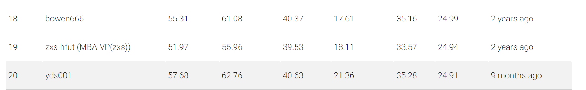

This repository is the official implementation of [LGK]



## Requirements

1. Install Matterport3D simulators: follow instructions [here](https://github.com/peteanderson80/Matterport3DSimulator). We use the latest version instead of v0.1.
```
export PYTHONPATH=Matterport3DSimulator/build:$PYTHONPATH
```

2. Install requirements:
```setup
conda create --name vlnduet python=3.8.5
conda activate vlnduet
pip install -r requirements.txt
```

3. Download data from [Dropbox](https://www.dropbox.com/sh/u3lhng7t2gq36td/AABAIdFnJxhhCg2ItpAhMtUBa?dl=0), including processed annotations, features and pretrained models of REVERIE and R2R datasets. Put the data in `datasets' directory.

4. Download pretrained lxmert
```
mkdir -p datasets/pretrained 
wget https://nlp.cs.unc.edu/data/model_LXRT.pth -P datasets/pretrained
```

## Pretraining

Combine behavior cloning and auxiliary proxy tasks in pretraining:
```pretrain
cd pretrain_src
bash run_reverie.sh # (run_r2r.sh)
```

## Fine-tuning & Evaluation

Use pseudo interative demonstrator to fine-tune the model:
```finetune
cd map_nav_src
bash scripts/run_reverie.sh # (run_r2r.sh)
```
